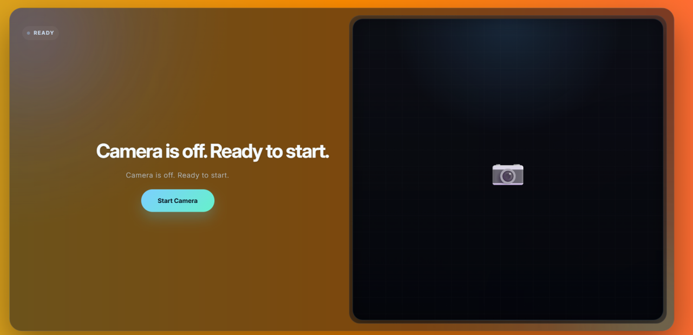
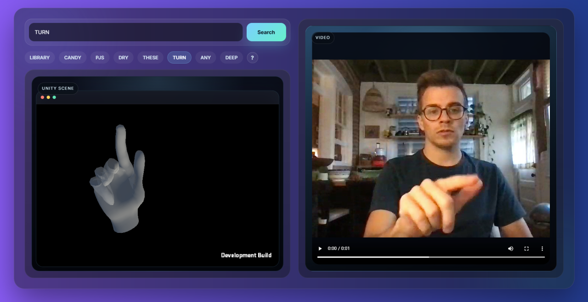

# 手语翻译与学习平台

一个集成实时手语翻译、3D 手语动作教学及搜索功能的综合性学习平台。本项目旨在通过计算机视觉和 3D 可视化技术，搭建健听人与听障人士之间的沟通桥梁。

## 🚀 主要功能

### 1. 实时手语翻译 (Translate Page)

利用摄像头实时捕捉手语动作，并通过自训练模型进行解析。
- **即时反馈**：模型解析后的文本输出。
- **置信展示**：提供识别置信度（Confidence)。

### 2. 手语教学中心 (Learning Page)

一个海量的手语动作库，支持精准搜索和日常学习。
- **资源丰富**：提供相关手语教学视频及高精度 3D 放大模型。
- **交互式 3D 视角**：
    - `Alt + 鼠标左键`：旋转 3D 视角，全方位观察动作细节。
    - `鼠标中键`：平移视角，灵活调整观察位置。

### 3. 联系我们 (Contact Page)

了解团队背景，获取更多项目信息。我们期待与开发者、教育者及手语爱好者的进一步交流与合作。

---

## 🛠 使用说明

### 翻译功能使用流程
1. 进入 **Translate Page**。
2. 授权开启摄像头。
3. 在镜头前做出手语动作，系统将实时显示翻译文本置信度。
4. 注意：**光照、背景和人物大小**等都会影响结果

### 学习功能使用流程

1. 进入 **Learning Page**。
2. 在搜索框输入你想学习的词汇。
3. 点击搜索结果，通过视频和 3D 模型进行临摹学习。
4. 使用快捷键（Alt+左键/中键）调整 3D 模型至最佳观察角度。

---

## 📸 界面预览

|                                                           翻译页面                                                            |                                                                      学习页面                                                                      |
| :---------------------------------------------------------------------------------------------------------------------------: | :------------------------------------------------------------------------------------------------------------------------------------------------: |
| | |

---

## ⌨️ 快捷键指南 (3D 模型交互)

| 动作     | 快捷键           | 描述                       |
| :------- | :--------------- | :------------------------- |
| **旋转** | `Alt + 鼠标左键` | 360度旋转观察手势细节      |
| **平移** | `鼠标中键`       | 移动 3D 模型在屏幕中的位置 |

---

**联系我们：** 欢迎通过 Contact Page 提交反馈或建议！
